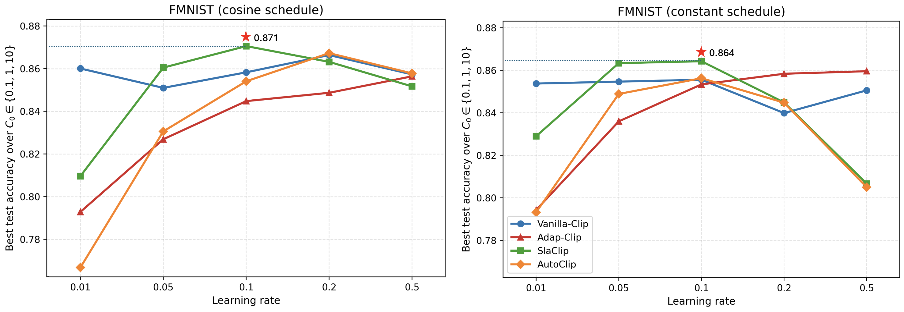

# Supplementary figures

## Reviewer iPfu

### caption

### caption
**Figure S2.** Heatmaps comparing the two closest adaptive clipping baselines, Adap-Clip and SlaClip, on FMNIST. The four panels show Adap-Clip (constant), SlaClip (constant), Adap-Clip (cosine), and SlaClip (cosine), respectively. The x-axis is the learning rate, and the y-axis is the initial clipping threshold $C_0 \in \{0.1, 1, 10\}$. Each cell reports the final test accuracy for one $(\text{lr}, C_0)$ pair.

### caption
