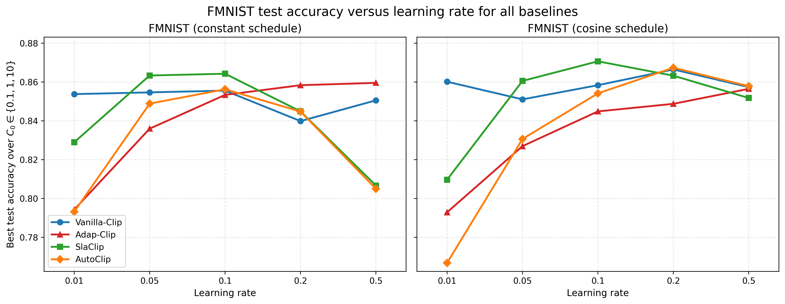

# Supplementary figures

## Reviewer iPfu
### FMNIST test accuracy versus learning rate for baselines

### FMNIST Heatmaps for Adap-Clip and SlaClip

### CIFAR-10 Heatmaps for Adap-Clip and SlaClip

