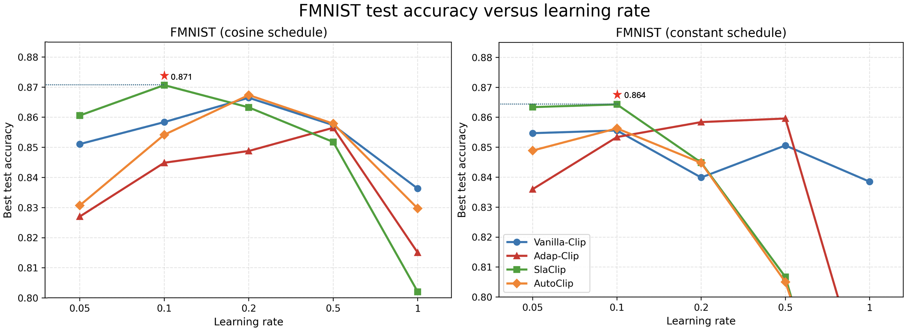
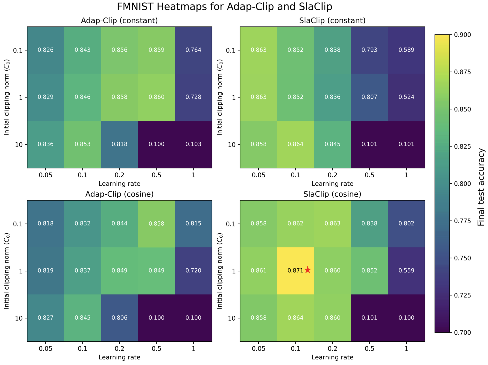
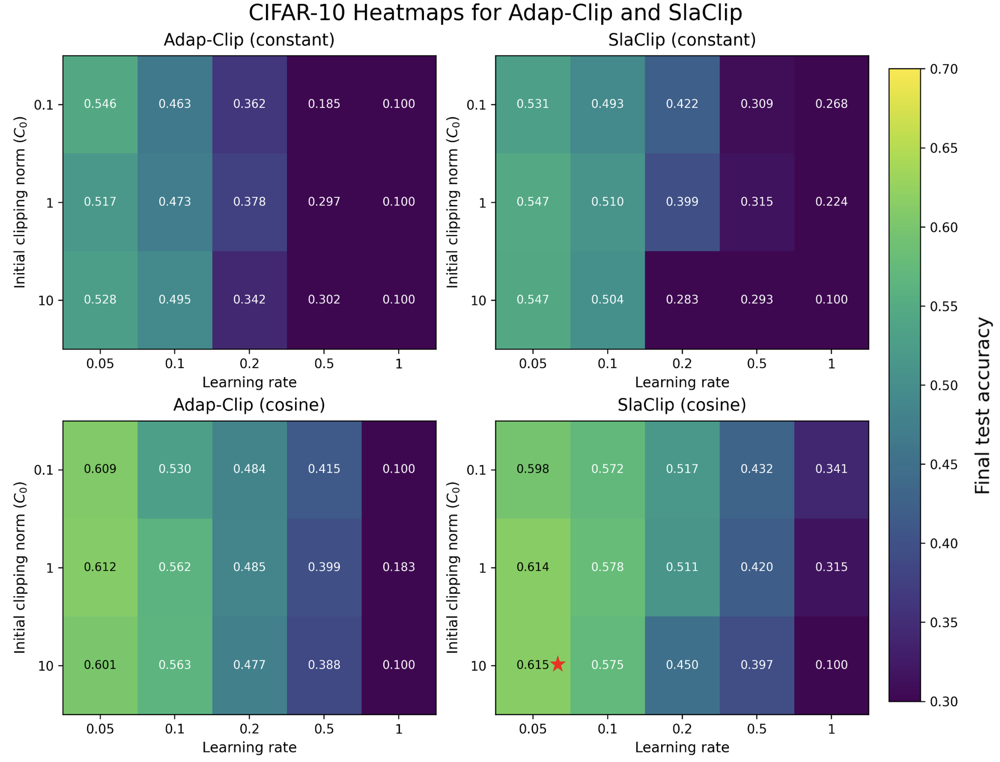

# Supplementary figures

## Reviewer iPfu

**Figure S1.** FMNIST test accuracy versus learning rate for all four baselines under the shared tuning protocol. For each method, each point shows the best test accuracy over the clipping-threshold pool $C_0 \in \{0.1, 1, 10\}$ at the corresponding learning rate $\{0.05, 0.1, 0.2, 0.5, 1.0\}$. The left panel shows the cosine schedule, and the right panel shows the constant schedule. When the learning rate is 1.0, all adaptive clipping methods drop sharply below 77% accuracy. We therefore omit that range in the y-axis and focus on the 80%--90% interval, which provides a clearer view of the relative differences in the more comparable accuracy regime.

**Figure S2.** Heatmaps comparing the two closest adaptive clipping baselines, Adap-Clip and SlaClip, on FMNIST. The x-axis is the learning rate, and the y-axis is the initial clipping threshold $C_0 \in \{0.1, 1, 10\}$. Each cell reports the final test accuracy for one $(\text{lr}, C_0)$ pair.

### caption
